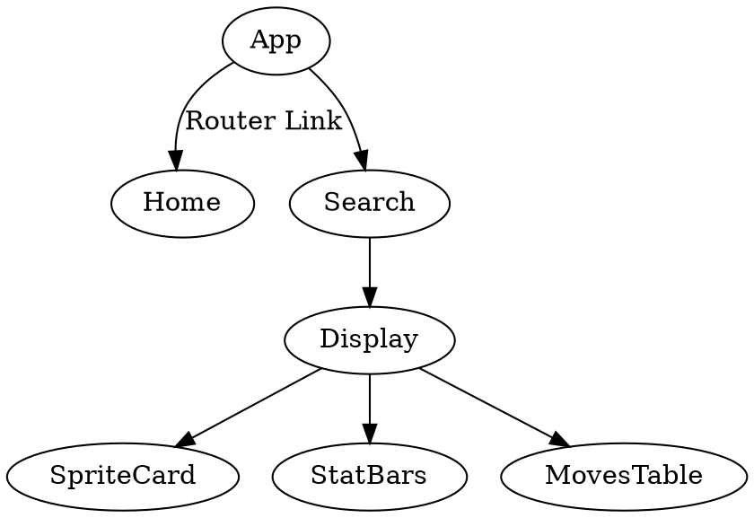

# PokeDex

This project was generated with [Angular CLI](https://github.com/angular/angular-cli) version 10.1.6.

## To add/remove library component
The `modules/display-material.module.ts` has all the module components I've used for this project.

If you want to add/ remove any library component. You can modify this file

The library I use is: [Angular Material](https://material.angular.io/components)

To run this project:
First download the source code using :
`git clone --recursive https://github.com/luckhoi56/pokeDex`

Then, go to your project folder, type:
`npm update` to download all the dependencies

Last:
`ng serve`

